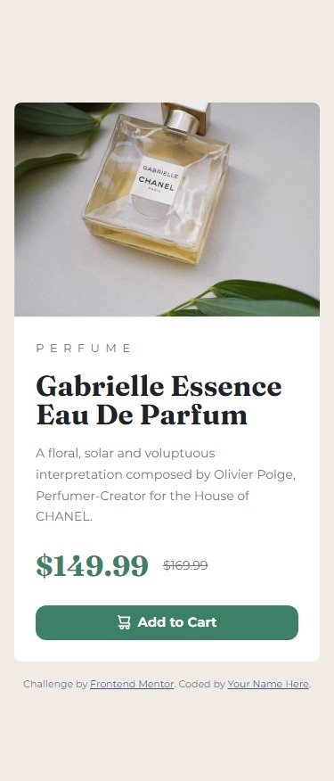

# Frontend Mentor - Product preview card component solution

This is a solution to the [Product preview card component challenge on Frontend Mentor](https://www.frontendmentor.io/challenges/product-preview-card-component-GO7UmttRfa). Frontend Mentor challenges help you improve your coding skills by building realistic projects.

## Table of contents

- [Frontend Mentor - Product preview card component solution](#frontend-mentor---product-preview-card-component-solution)
  - [Table of contents](#table-of-contents)
  - [Overview](#overview)
    - [The challenge](#the-challenge)
    - [Screenshot](#screenshot)
    - [Links](#links)
  - [My process](#my-process)
    - [Built with](#built-with)
    - [What I learned](#what-i-learned)
    - [Continued development](#continued-development)
    - [Useful resources](#useful-resources)
  - [Author](#author)
  - [Acknowledgments](#acknowledgments)

## Overview

### The challenge

Users should be able to:

- View the optimal layout depending on their device's screen size
- See hover and focus states for interactive elements

### Screenshot

### Links

- Solution URL: [Add solution URL here](https://www.frontendmentor.io/solutions/product-preview-card-component-9xh0i4MdJM)
- Live Site URL: [Add live site URL here](https://fm-product-preview-card-component-three.vercel.app/)

## My process

This is made by following the video of [Kevil Powell's frontend mentor challenge](https://www.youtube.com/watch?v=B2WL6KkqhLQ&list=PL4-IK0AVhVjPregcc6pgAIerVqSWaJEM4). It's a copy of his solution but I went through it step by step.

### Built with
- Semantic HTML5 markup
- CSS custom properties
- Flexbox
- CSS Grid
- Mobile-first workflow
- [CSS Reset by Josh Comeau](https://www.joshwcomeau.com/css/custom-css-reset/)

### What I learned

First and foremost, I learned how Kevin Powell tackles a project from scratch. How he laid out everything on the HTML. All the content, alternate content, and classes the project would possibly contain. Then proceeding on styling the component.

Next is how he defined some of the HTML5 elements. He mentioned that an `article` can be a standalone piece of content where that piece of code can be taken out and moved to another webpage easily. Then the usage of `picture` and `source` elements, it's quite convenient now to be able to switch images from HTML only.

I also learned a couple of CSS Grid stuff since I really haven't touched CSS Grid and I will probably look through and use it on the next challenge that I'll do.

### Continued development

Here's a list of things I'll want to focus on.
- CSS Grid
- Working and structuring with Sass

### Useful resources

- [CSS Reset by Josh Comeau](https://www.joshwcomeau.com/css/custom-css-reset/) - I highly recommend reading the explanation of each of the CSS he wrote on his CSS Reset snippet. I learned a lot of CSS concepts while reading through it.

## Author

- Frontend Mentor - [@alvinjohnsonso](https://www.frontendmentor.io/profile/alvinjohnsonso)
- Github - [@alvinjohnsonso](https://github.com/alvinjohnsonso)

## Acknowledgments

I just wanted to say thank you to Kevin Powell. I've been watching his youtube videos regarding on CSS for the past week and I've really learned a lot. Especially on his video with this challenge.
